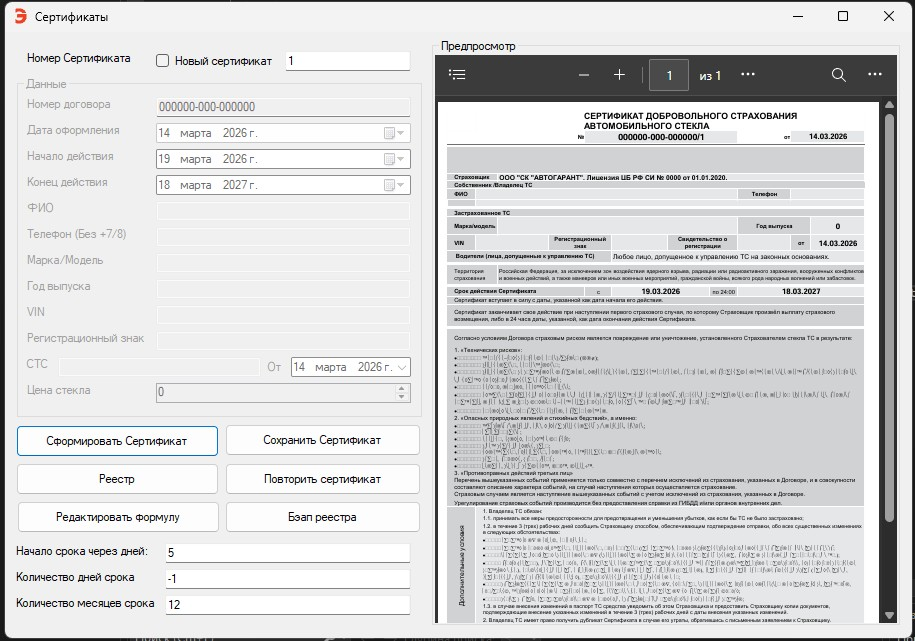

# CertificateCollectorRm94

Настольное Windows-приложение для оформления, учёта и управления сертификатами страхования автостекол. Написано для реального страхового агента — используется в продакшене с момента выпуска.



## Стек

- **C# / .NET Framework 4.7.2**
- **Windows Forms** — UI
- **Microsoft Excel Interop** — шаблон сертификата и реестр
- **Microsoft Edge WebView2** — предпросмотр PDF прямо в приложении

## Как это работает

Шаблон сертификата — это `Certificate_demo.xlsx` с заранее размеченными ячейками. При генерации приложение открывает Excel в фоне, заполняет нужные координаты данными и экспортирует лист в PDF через `ExportAsFixedFormat`. Готовый PDF отображается во встроенном WebView2.

Реестр хранится в отдельном Excel-файле через тот же Interop. Все сертификаты сохраняются туда автоматически при генерации.

## Возможности

**Сертификаты**
- Заполнение формы: ФИО, VIN, рег. знак, свидетельство о регистрации, даты, цена стекла
- Автоматический расчёт страховой премии: 10% от цены стекла, минимум 1000₽ (порог и процент настраиваются)
- Повтор сертификата — создаёт новый на основе существующего с пересчётом дат
- Предпросмотр PDF до сохранения
- Сохранение в произвольное место через диалог

**Реестр**
- Таблица всех выданных сертификатов
- 8 режимов поиска: по номеру, диапазону номеров, VIN, телефону, датам оформления, действующие на дату, истекающие через N дней, текстовый поиск
- Экспорт отфильтрованного реестра в Excel
- Бэкап с ротацией (хранится до 10 последних копий)

**Настройки**
- Смещение дат начала и окончания действия сертификата
- Редактор параметров расчёта премии (минимум, порог, процент)
- Все настройки сохраняются в `settings.json`

## Системные требования

- Windows 10 / 11
- Microsoft Excel (Interop — нужен установленный Office)
- Microsoft Edge WebView2 Runtime
- .NET Framework 4.7.2+

## Установка

1. Собрать проект в Visual Studio (Release)
2. Положить `Certificate.xlsx` в папку `DataFiles/` рядом с `.exe`
3. Запустить — при первом старте создаётся `settings.json` с дефолтными параметрами

> Шаблон в репозитории — демо-версия с обезличенными данными. Координаты ячеек соответствуют реальному шаблону.

## Структура проекта

```
CertificateCollectorRm94/
├── Models/
│   ├── CertificateData.cs      # Данные сертификата
│   ├── SettingsData.cs         # Настройки и расчёт дат
│   └── RegistryStatistics.cs   # Статистика реестра
├── Services/
│   ├── CertificateService.cs   # Генерация PDF через Excel Interop
│   └── RegistryService.cs      # Хранение и поиск по реестру
├── MainMenu.cs                 # Главная форма
├── DataGrid.cs                 # Форма реестра
└── PriceDialog.cs              # Диалог настройки премии
```

## Changelog

### v1.1 (Июль 2025)
- Поле цены стекла и автоматический расчёт премии
- Редактор параметров расчёта
- Бэкап с ротацией до 10 файлов

### v1.0 (Июль 2025)
- Создание и управление сертификатами
- Реестр с поиском и фильтрацией
- Экспорт в Excel
- Предпросмотр и печать PDF